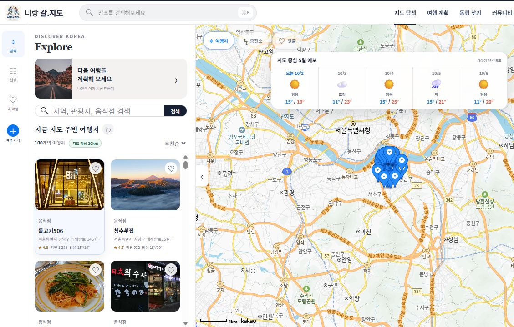
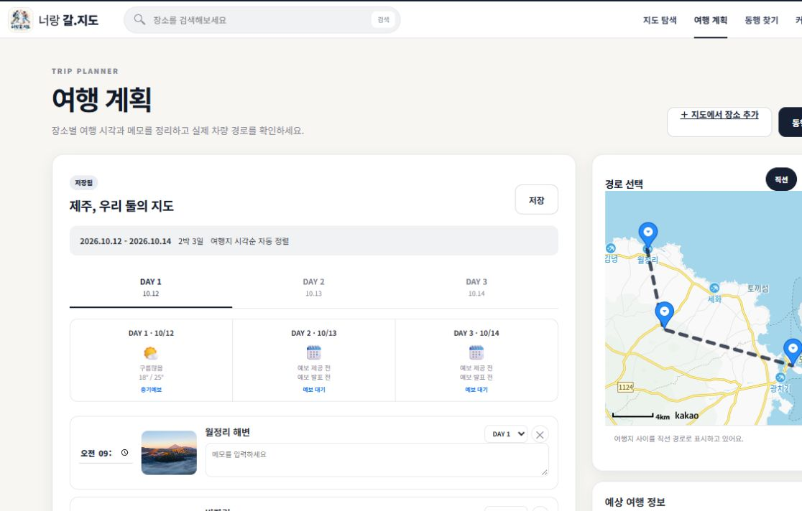
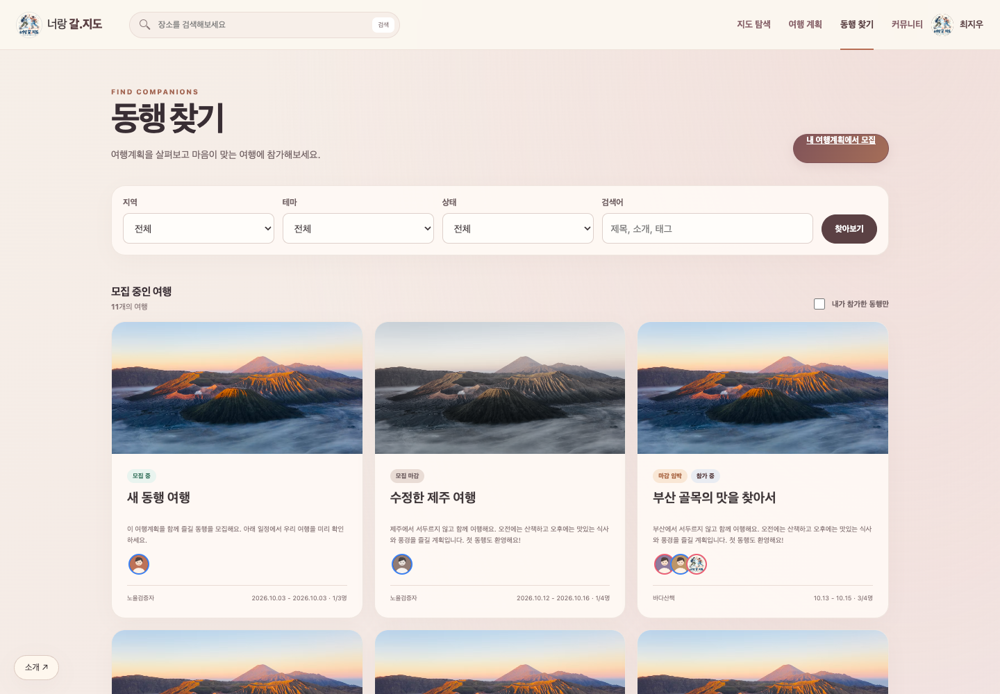
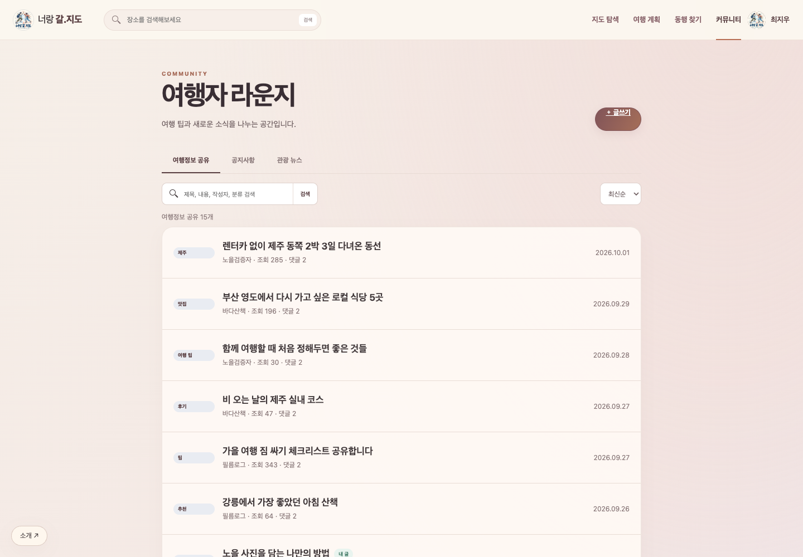

# 너랑 갈.지도

> 너랑 갈 다음 여행을 지도 위에

`너랑 갈.지도`는 지도에서 여행지를 탐색하고, 날짜와 시간에 맞춰 여행 일정을 만든 뒤, 같은 여행을 함께할 동행까지 찾을 수 있는 지도 기반 여행 웹앱입니다.

관광지 검색에서 끝나는 대신 **여행지 탐색 → 일정 설계 → 이동 경로 확인 → 동행 모집 → 여행 정보 공유**가 하나의 흐름으로 이어지도록 구성했습니다.

## 프로젝트 소개

- 프로젝트 유형: 지도 기반 여행 정보 검색 및 동행 매칭 서비스
- 개발 기간: SSAFY 프론트엔드 관통 프로젝트
- 개발 인원: 2명
- 개발 환경: HTML, CSS, JavaScript, VS Code
- 저장 방식: 브라우저 `localStorage`
- 지원 화면: 데스크톱, 태블릿, 모바일

API 키가 없거나 외부 API 요청에 실패해도 주요 화면을 확인할 수 있도록 내장 데모 데이터를 함께 제공합니다.

## 주요 사용자 흐름

1. 지도를 이동하거나 검색어와 카테고리로 주변 여행지를 찾습니다.
2. 마음에 드는 여행지를 일정에 추가합니다.
3. 여행 날짜별 시간과 메모를 작성하고 자동 정렬된 일정을 확인합니다.
4. 직선 경로와 카카오모빌리티 차량 경로를 비교합니다.
5. 완성한 여행계획을 동행 모집글로 발행합니다.
6. 동행에 참가하거나 커뮤니티에서 여행 정보를 공유합니다.

### 사용자 흐름 캡처

#### 1) 지도에서 여행지 탐색

지도 중심을 이동하면서 주변 관광지를 확인하고, 검색·필터·날씨 정보를 함께 살펴봅니다.



#### 2) 여행계획 작성

여행지를 DAY별 일정에 추가하고 방문 시각, 메모, 날씨와 이동 경로를 확인합니다.



#### 3) 동행 찾기

지역·테마·상태로 모집 중인 여행을 찾고, 나의 여행계획에서 새 모집글을 만들 수 있습니다.



#### 4) 커뮤니티에서 여행 정보 공유

여행정보 공유 게시판에서 다른 여행자의 글을 읽고, 글쓰기와 댓글로 경험을 나눕니다.



## 핵심 기능

### 지도 탐색

- 카카오맵 드래그 이동 및 휠 확대·축소
- 현재 지도 중심 반경의 한국관광공사 TourAPI 여행지 검색
- 관광지·숙박·음식점·문화시설·여행코스 카테고리 필터
- 지도 마커와 여행지 카드 동기화
- 여행지 상세정보, 찜, 일정 추가
- 여행지 패널 접기·펼치기
- 날씨·전기차 충전소·핫플레이스 레이어 표시 전환

### 여행 계획

- 여행지별 DAY, 방문 시각, 메모 편집
- 방문 시각 기준 일정 자동 정렬
- 직선 경로와 카카오모빌리티 차량 경로 전환
- 예상 이동 거리와 시간 표시
- 기상청 단기예보와 중기예보를 결합한 일자별 날씨
- 완성한 여행계획을 동행 모집글로 발행

### 회원 및 마이페이지

- 이메일, 비밀번호, 이름, 닉네임, 생년월일, 성별, 사진 회원가입
- 로그인·로그아웃과 로그인 필요 기능 보호
- 닉네임과 프로필 사진 수정
- 비밀번호 변경과 회원탈퇴
- 프로필 사진 정사각형 압축 저장

### 동행 찾기

- 지역·테마·모집 상태별 필터와 검색
- 동행 모집글 상세 일정 확인
- 모집 정원에 따른 참가·취소와 마감 처리
- 작성자만 모집글 수정 가능
- 참가자의 성별에 따라 프로필 테두리 색상 구분

### 커뮤니티

- 여행정보 공유·공지사항·관광 뉴스 게시판
- 게시글 목록, 검색, 상세, 글쓰기
- 작성자만 게시글 수정·삭제 가능
- 댓글 작성 및 본인 댓글만 수정·삭제 가능
- 사용자 닉네임·프로필 변경 사항을 작성 콘텐츠에 동기화

## 팀원 소개 및 업무 분담

| 팀원 | 담당 영역 | 주요 구현 내용 |
| --- | --- | --- |
| 김강민 | 지도·여행계획·외부 API·통합 | 카카오맵, TourAPI 주변 검색, 여행지 레이어, 기상청 예보, 충전소, 일정 편집, 카카오모빌리티 경로, 공통 상태 구조, 통합 테스트 |
| 마예은 | 회원·동행·커뮤니티 | 회원가입·로그인, 프로필 관리, 동행 목록·상세·참가 권한, 게시글·댓글 CRUD와 소유자 권한, 서브페이지 반응형·접근성 |

공통 파일은 변경 전 구조를 합의하고, 페이지 단위로 담당 파일을 나눠 충돌을 줄였습니다. 자세한 기준은 [업무 분담 문서](./docs/WORK_SPLIT.md)를 참고하세요.

## 기술 구성

| 구분 | 사용 기술 |
| --- | --- |
| 마크업·스타일 | HTML5, CSS3, 반응형 미디어 쿼리 |
| 프론트엔드 | Vanilla JavaScript, ES Modules, Fetch API |
| 지도·경로 | Kakao Maps JavaScript API, Kakao Mobility Directions API |
| 관광 데이터 | 한국관광공사 국문관광정보 서비스 TourAPI |
| 날씨 | 기상청 단기예보·중기예보 API |
| 기타 데이터 | 한국환경공단 전기차 충전소 API, Sunrise-Sunset API |
| 상태 저장 | Web Storage API (`localStorage`) |
| 개발 서버 | Node.js 기본 `http` 모듈 |

## 실행 방법

### 1. 저장소 실행

별도 패키지 설치는 필요하지 않습니다. ES Module과 카카오모빌리티 프록시를 사용하므로 HTML 파일을 직접 열지 말고 로컬 서버로 실행합니다.

```bash
node dev-server.js
```

브라우저에서 [http://localhost:5500](http://localhost:5500)을 엽니다.

VS Code Live Server로 일반 화면을 확인할 수는 있지만, 차량 경로 프록시까지 테스트하려면 `dev-server.js` 사용을 권장합니다.

### 2. API 설정

`config.example.js`를 복사해 `config.js`를 만들고 발급받은 키를 입력합니다.

```bash
cp config.example.js config.js
```

Windows PowerShell:

```powershell
Copy-Item config.example.js config.js
```

```js
window.APP_CONFIG = {
  KAKAO_JS_KEY: "",
  KAKAO_REST_KEY: "",
  TOUR_API_KEY: "",
  WEATHER_API_KEY: "",
  EV_CHARGER_API_KEY: "",
  SGIS_CONSUMER_KEY: "",
  SGIS_CONSUMER_SECRET: "",
  API_PROXY_URL: "http://localhost:5500",
};
```

`config.js`는 `.gitignore`에 포함되어 있으므로 Git에 커밋되지 않습니다.

### 3. API 사용 시 확인사항

- 카카오 JavaScript 키: 앱의 Web 플랫폼에 `http://localhost:5500` 등록
- 카카오 REST API 키: 차량 길찾기 요청에 사용
- 공공데이터포털 키: `URLSearchParams`가 인코딩하므로 일반적으로 Decoding 키 사용
- 기상청 중기예보: 별도 활용 신청 및 승인 상태 확인
- `API_PROXY_URL`: 기본 개발 서버를 사용할 때 `http://localhost:5500` 지정

## 데이터 출처

- [한국관광공사 국문관광정보 서비스](https://www.data.go.kr/data/15101578/openapi.do)
- [SGIS 오픈 API](https://sgis.kostat.go.kr/developer/html/main.html)
- [카카오 지도 Web API](https://apis.map.kakao.com/web/)
- [카카오모빌리티 길찾기 API](https://developers.kakaomobility.com/docs/navi-api/directions/)
- [기상청 단기예보 조회서비스](https://www.data.go.kr/data/15084084/openapi.do)
- [기상청 중기예보 조회서비스](https://www.data.go.kr/data/15059468/openapi.do)
- 한국환경공단 전기자동차 충전소 정보
- [Sunrise-Sunset API](https://sunrise-sunset.org/api)

## 프로젝트 구조

```text
.
├─ index.html                  # 지도 탐색
├─ planner.html                # 여행계획
├─ signup.html                 # 회원가입·로그인
├─ mypage.html                 # 프로필·계정 관리
├─ companions.html            # 동행 목록
├─ companion-detail.html      # 동행 상세
├─ community.html             # 커뮤니티 목록
├─ post-detail.html           # 게시글·댓글
├─ post-write.html            # 게시글 작성·수정
├─ dev-server.js              # 정적 서버·카카오모빌리티 프록시
├─ config.example.js          # API 설정 예시
├─ assets/                    # 로고·이미지
├─ css/
│  ├─ style.css               # 지도·공통 UI
│  └─ subpages.css            # 서브페이지 UI
├─ docs/
│  ├─ WORK_SPLIT.md           # 업무 분담
│  └─ TROUBLE_SHOOTING.md     # 문제 해결 기록
└─ js/
   ├─ api.js                  # 외부 API 모듈
   ├─ app.js                  # 지도 탐색
   ├─ planner.js              # 여행계획
   ├─ shared.js               # 공통 상태·UI 유틸리티
   ├─ account.js              # 계정·프로필 유틸리티
   ├─ companion-utils.js      # 동행 상태·권한 유틸리티
   ├─ board.js                # 게시판 상태·권한 유틸리티
   └─ 페이지별 스크립트
```

## 상태 저장 방식

프론트엔드 프로젝트 범위에 맞춰 다음 데이터를 `neorang-galjido-v1` 키의 `localStorage`에 저장합니다.

- 회원·프로필 정보와 로그인 상태
- 찜한 장소와 여행 일정
- 동행 모집글과 참가 상태
- 게시글과 댓글
- 핫플레이스와 지도 설정

브라우저 저장소를 삭제하면 데모 초기 상태로 돌아갑니다. 실제 서비스로 확장할 때는 비밀번호를 브라우저에 저장하지 않고 서버 인증, 데이터베이스, 이미지 스토리지를 사용해야 합니다.

## 검증 방법

```bash
node --check js/app.js
node --check js/planner.js
node --check js/shared.js
git diff --check
```

통합 시에는 지도 이동·레이어 토글·일정 저장·차량 경로·회원가입·동행 참가·게시글과 댓글 권한을 브라우저에서 함께 확인합니다.

## 트러블슈팅

지도 위치와 무관하게 제주 관광지만 표시되던 문제, 차량 경로 CORS, 날씨 예보 기간 결합, 프로필 이미지 저장 용량, Git 충돌 방지 과정은 [트러블슈팅 문서](./docs/TROUBLE_SHOOTING.md)에 정리했습니다.

## 2026-10-03 업데이트와 체험 방법

노을 구름의 큰 이미지와 스크롤 안내를 사용한 [소개 화면](./intro.html)을 추가했습니다. 첫 방문에 한 번 표시되고 이후 좌측 하단 ‘소개’에서 다시 열 수 있습니다. 크림·살구·모브 색상으로 공통 화면을 재구성했습니다. 디자인 참고는 [트리니티항공 브랜드 소개](https://brand.trinityairways.com/kr/)이며, 항공사의 문구·브랜드·이미지를 복제하지 않고 여행 앱에 맞는 설명과 AI 생성 배경을 사용했습니다.

로그인 화면에서 체험 계정을 누르면 이메일과 비밀번호가 채워집니다. `traveler1@example.com`부터 `traveler10@example.com`까지 10명이 있으며 공통 비밀번호는 `Trip2026!`입니다. 10번째 계정 ‘여행지기’는 공지사항을 관리할 수 있는 운영자입니다. 새로 가입한 회원은 기존 회원 데이터를 지우지 않습니다.

저장된 여행계획 40개와 동행 40개, 게시물 50개, 프로필과 댓글이 서로 연결되어 있습니다. 회원별 계획은 여행계획 상단에서 골라 열 수 있습니다. 지도에서 장소를 담고 날짜·시간·메모·경비를 정리한 뒤 저장→동행 구하기로 이어집니다. 공유한 일정은 같은 계획 ID로 업데이트하고 참가자와 마감 상태를 유지합니다. 모집자는 상세에서 ‘참여마감’을 누를 수 있습니다.

날씨는 기본 OFF이고 지도 버튼으로 전환합니다. 충전소는 전국 데이터 대신 지도 중심의 지역만 조회하며, 첫 결과부터 표시하고 같은 지역은 2분 캐시를 재사용합니다. 화면에는 최대 80개 충전소를 표시하며 지역 일부만 조회된 경우 이를 안내합니다.

전체 요구사항의 구현 여부와 미구현 범위는 [기능 검증 보고서](./docs/FEATURE_AUDIT.md), 원인과 개선 기록은 [트러블슈팅](./docs/TROUBLE_SHOOTING.md)을 확인하세요. 서버 뉴스 크롤링/DB, 실제 이메일 인증과 비밀번호 복구, 다른 브라우저와의 공유는 백엔드 연결 전까지 제공되지 않습니다.

### 재현 가능한 검증

기본 Node.js 검사(패키지 설치 불필요):

```bash
node tests/api.cjs
for file in js/*.js; do node --check "$file"; done
git diff --check
```

브라우저 검증은 Playwright와 설치된 Chrome을 사용합니다. 개발 서버를 실행한 뒤:

```bash
node tests/e2e.cjs
node tests/live.cjs
```

Playwright가 기본 모듈 경로에 없으면 `PLAYWRIGHT_MODULE`에 설치된 Playwright 패키지 절대 경로를 지정할 수 있습니다. `e2e.cjs`는 별도 브라우저 프로필에서 설정 키를 비활성화하고 로컬 기능을 검증합니다. `live.cjs`는 현재 `config.js`의 실제 API 설정이 필요합니다. 테스트는 일반 사용자의 브라우저 저장소를 수정하지 않습니다.

최종 통합 검증: 62개 체크 통과, JavaScript 페이지 오류 0개. 실제 충전소 테스트: 약 1.4초(단일 측정), 8요청, 최대 80곳, 같은 지역 재활성화 추가 요청 0회. 자세한 한계와 검증 조건은 보고서에 기록했습니다.

2026-10-03 지도 작업 흐름: 메인의 **둘러보기 / 내 여행**은 이미지 카드 목록을 표시합니다. 카드를 누르면 해당 여행만 보여주며, 직선/차량경로 토글과 DAY별 동선·날씨를 확인할 수 있습니다. 두 경로 모두 붉은 실선으로 표시합니다. **세부내용 보기**는 동행 상세 또는 해당 여행계획 페이지로 연결하고, **내 여행 → 새 여행 작성**은 빈 여행계획 페이지를 엽니다. 지도 아이콘 메뉴의 **로드뷰 → 파란 도로 더블클릭**으로 이동 가능한 로드뷰 팝업을 엽니다.

추가 브라우저 검증: `node tests/workspace.cjs`, `node tests/workspace-guest.cjs`, `node tests/roadview.cjs`. 기존 검증과 동일하게 Playwright와 Chrome을 사용합니다.

핫플은 현재 지도 범위의 저장된 여행계획을 집계한 인기 장소 최대 10개입니다. 회원별 중복 추가는 인기 인원에 한 번만 반영하고, 일정 수를 함께 표시합니다. 현재 프론트엔드 체험에서는 이 브라우저에 저장된 회원·계획을 기준으로 하며 등록 버튼은 제공하지 않습니다. 여행지 필터는 전체 버튼으로 모두 켜거나 끕니다.

추가 체험 데이터는 게시물 30개와 동행 공유계획 30개이며 기존 브라우저에 한 번만 추가됩니다. 공유계획마다 첫 방문지 사진, 이틀 일정, 장소 좌표, 모집자와 참가자가 연결되어 있습니다. 기존 글·댓글·계획 수정 내용은 유지하며 삭제한 추가 체험 데이터는 다시 채우지 않습니다.

상단·모바일 메뉴의 ‘내 여행’ 페이지에서는 회원별 저장 계획을 첫 방문지 사진 카드로 표시합니다. 카드에는 기간·지역·장소 수·공유 상태가 표시되며 선택하면 아래 세부 일정과 편집 화면으로 이동합니다. 날짜별 일정 확인, 계획 수정·저장, 동행 공유 흐름은 그대로 이어집니다. `tests/plan-cards.cjs`에서 카드 선택·계정별 목록·저장 후 카드 갱신과 모바일 화면을 검증합니다.
