# 너랑 갈.지도

> 너랑 갈 다음 여행을 지도 위에

지도에서 여행지를 발견하고, 나만의 일정을 만든 뒤 함께할 동행을 찾는 여행 웹앱입니다. **소개 → 지도 탐색 → 내 여행 작성 → 동행 공유·참여 → 여행 이야기 나누기** 순서로 사용할 수 있습니다.

HTML·CSS·JavaScript로 구현한 프론트엔드 프로젝트이며 회원, 계획, 게시글과 댓글은 브라우저 `localStorage`에 저장됩니다. 현재 체험 데이터는 **회원 10명, 커뮤니티 게시글 50개, 저장 계획 40개, 공유 동행계획 40개**입니다. 다른 브라우저와의 데이터 공유와 서버 인증은 백엔드 연결 후 제공할 예정입니다.

## 1. 소개 페이지 — 처음 만나는 너랑 갈.지도

처음 접속하면 소개 페이지가 자동으로 열립니다. 노을빛 구름 배경을 따라 서비스 설명과 ‘장소 담기 → 일정 정하기 → 동행 만나기 → 이야기 나누기’ 사용법을 확인한 뒤 지도 탐색으로 이동합니다. 이후에는 메인 왼쪽 아래 **소개 ↗** 버튼으로 다시 열 수 있습니다.

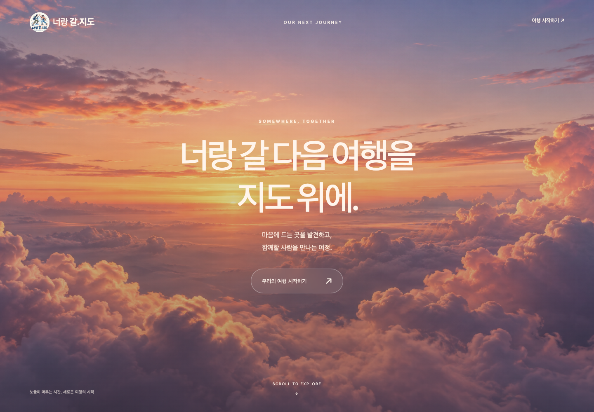

## 2. 메인 페이지 — 지도에서 발견하고 함께 떠나기

### 탐색 탭에서 주변 여행지 보기

지도를 이동하거나 장소를 검색하면 현재 지도 주변 여행지가 사진 카드와 마커로 나타납니다. 카드를 눌러 상세정보를 확인하고 **일정 추가**로 내 여행에 담습니다. 왼쪽 패널은 접기 버튼으로 숨길 수 있습니다.

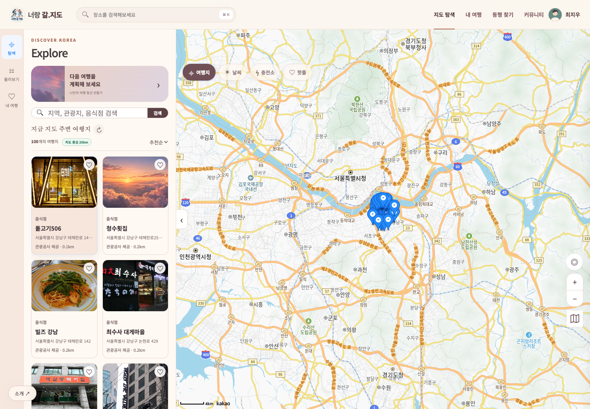

### 여행지 버튼으로 필터링

지도 위 **여행지** 버튼에서 관광지·맛집·숙소·문화·공연/행사·쇼핑·코스를 각각 켜거나 끕니다. **전체**를 누르면 모든 종류를 켜고, 다시 누르면 모두 끕니다. 선택한 종류에 맞춰 주변 카드와 마커가 갱신됩니다.

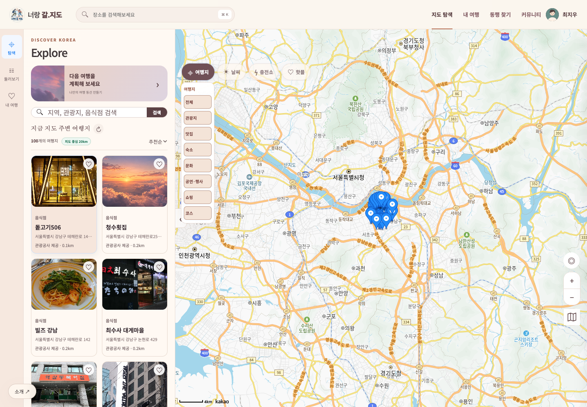

### 날씨 버튼으로 5일 예보 확인

**날씨** 버튼을 누르면 현재 지도 중심의 5일 예보를 볼 수 있습니다. 날짜별 날씨와 최저·최고기온을 확인하고 다시 누르면 숨깁니다. 실제 기상청 응답의 제공 기간에 따라 표시되는 날짜 수가 달라질 수 있습니다.

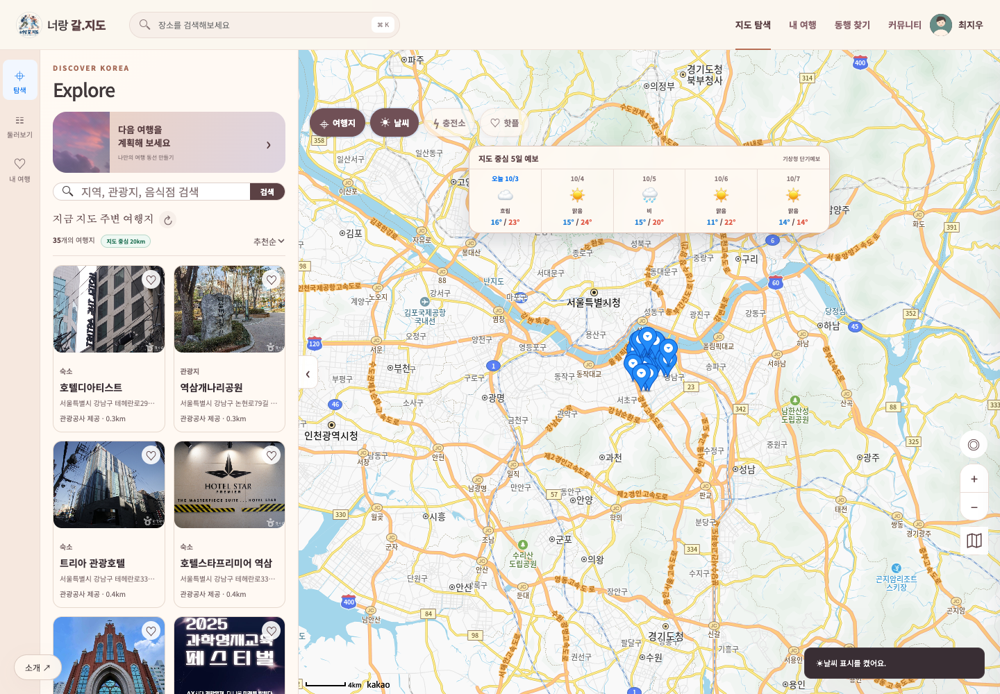

### 충전소 버튼으로 충전 현황 확인

**충전소**를 켜면 지도 주변 충전소가 표시됩니다. 번개 마커를 누르면 충전소 이름·주소, **충전 가능한 대수**, 전체 대수, 충전 중인 대수와 충전기별 상태를 확인합니다. 축척에 따른 표시 제한 없이 사용할 수 있으며, 성능을 위해 지도 중심 반경 20km 안에서 최대 80곳을 표시합니다. 지역 일부만 조회된 경우 화면에 안내합니다.

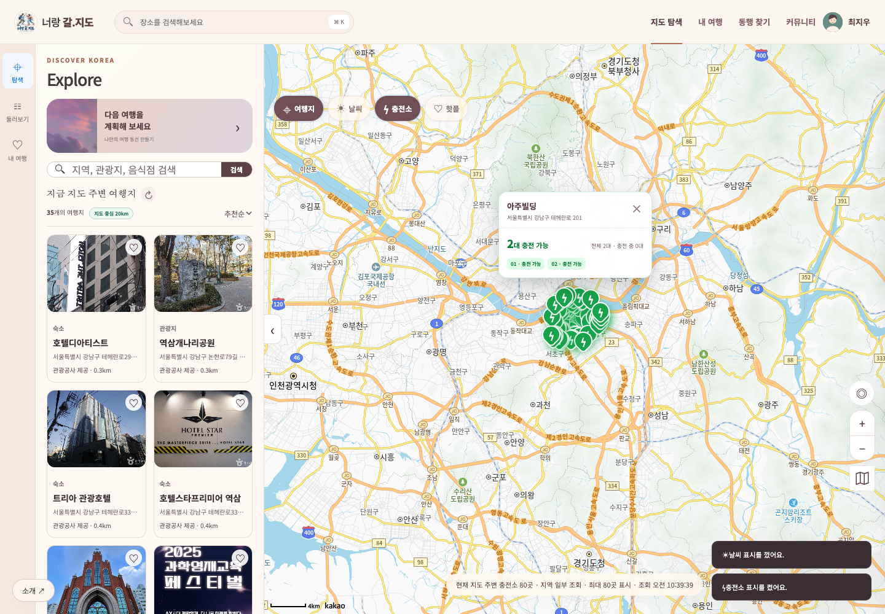

### 핫플 — 사람들이 여행계획에 많이 담은 장소

**핫플**을 켜면 현재 지도 범위에서 여행계획에 많이 추가된 장소 **최대 10곳**을 순위로 표시합니다. 장소별로 추가한 회원 수와 일정 수를 함께 볼 수 있습니다. 지도를 이동하면 범위에 맞춰 갱신되고, 장소를 누르면 정보를 보거나 내 일정에 추가할 수 있습니다. 현재는 이 브라우저에 저장된 회원들의 계획을 집계합니다.

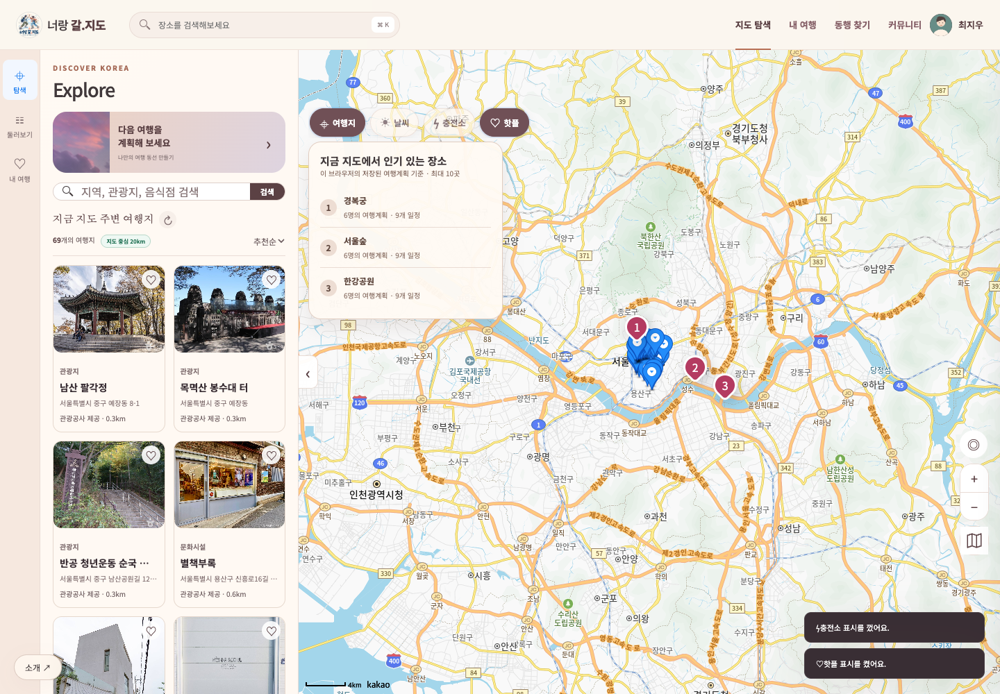

### 지도 타입 변경과 로드뷰

오른쪽 아래 **지도 아이콘**을 누르면 일반·스카이뷰·로드뷰·지형도 메뉴가 한 열로 펼쳐집니다. 원하는 지도로 바꿔 지형과 주변 환경을 확인할 수 있습니다.

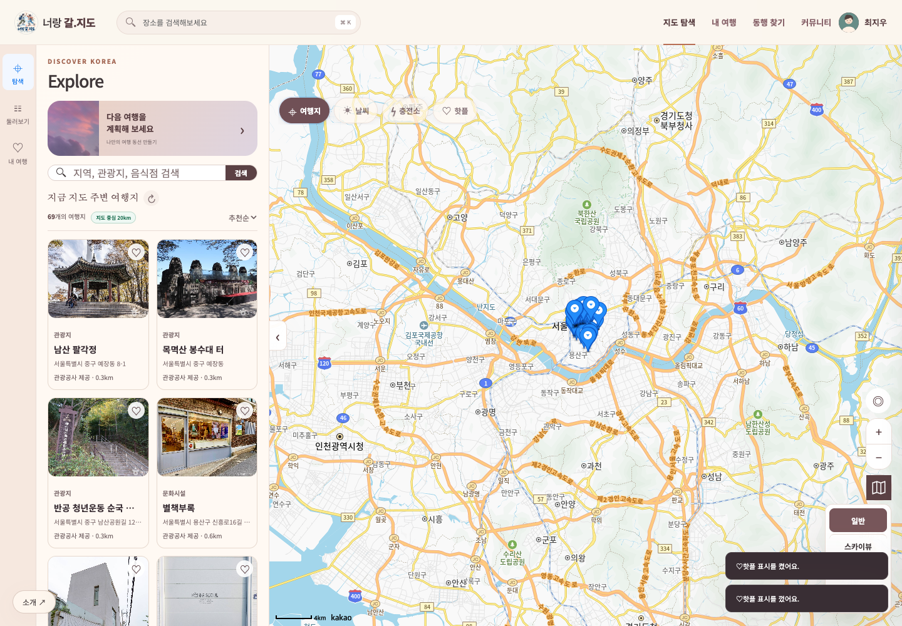

**로드뷰**를 선택하면 파란색으로 도로가 표시됩니다. 도로를 **더블클릭**하면 해당 위치의 로드뷰 팝업이 열립니다. 팝업 화면을 드래그해 방향을 바꾸거나 도로의 이동 화살표로 주변 다른 위치도 볼 수 있습니다.

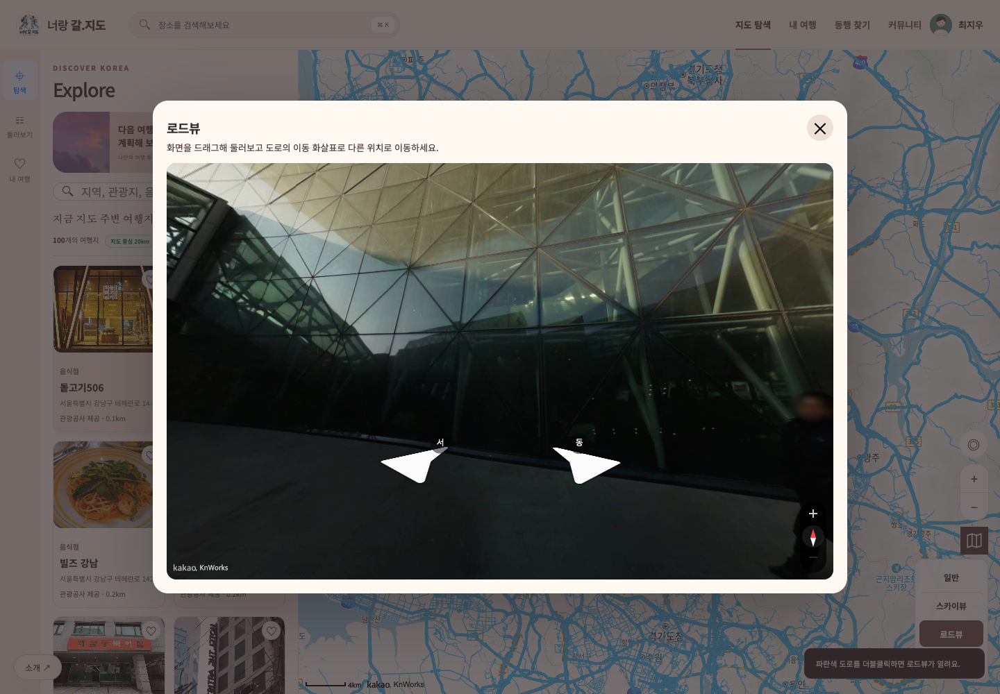

### 둘러보기 탭에서 공유 여행계획과 동행 참여

**둘러보기**에는 동행찾기에 올라온 공유 여행계획이 사진 카드로 표시됩니다. 카드를 누르면 선택한 여행의 소개·참가 인원·DAY별 일정과 날씨가 나타나며 지도도 해당 동선으로 이동합니다. 직선/차량경로를 바꿔 확인하고, **세부내용 보기**로 동행 상세 페이지를 엽니다.

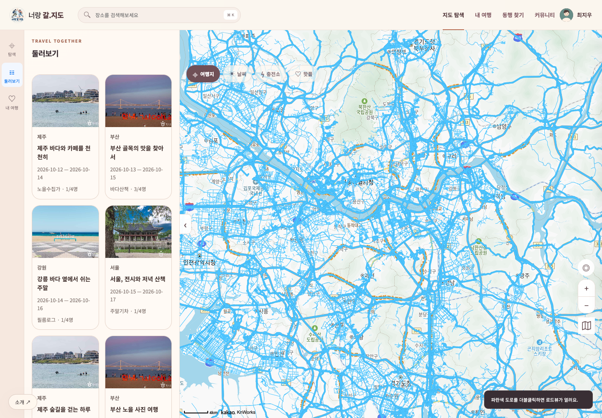

제목 옆 **동행하기**를 누르면 바로 참가하고 **참가 중**으로 바뀝니다. 참가 중 버튼을 다시 누르면 취소됩니다. 정원이 찼거나 모집자가 마감한 여행에는 새로 참가할 수 없고, 로그인 전이라면 로그인 후 선택한 여행으로 돌아옵니다.

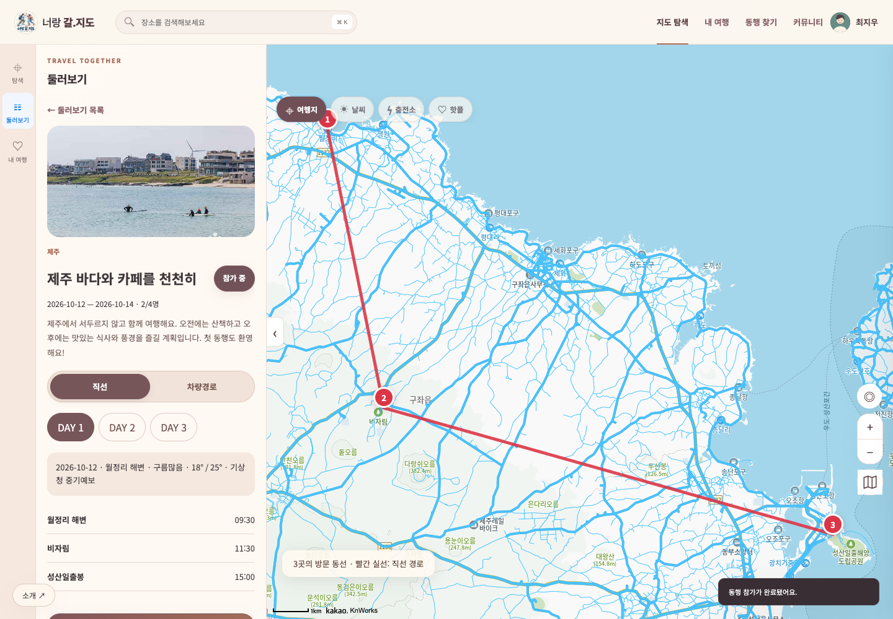

### 내 여행 탭에서 내 계획과 동선 확인

**내 여행** 탭에는 로그인한 내가 작성한 계획만 표시됩니다. 카드 선택 후 **직선 / 차량경로** 토글과 DAY 버튼으로 동선을 확인합니다. 두 경로 모두 붉은 실선으로 표시합니다. **새 여행 작성**은 내 여행 페이지의 새 계획 작성으로, **세부내용 보기**는 선택한 계획의 편집 화면으로 연결됩니다.

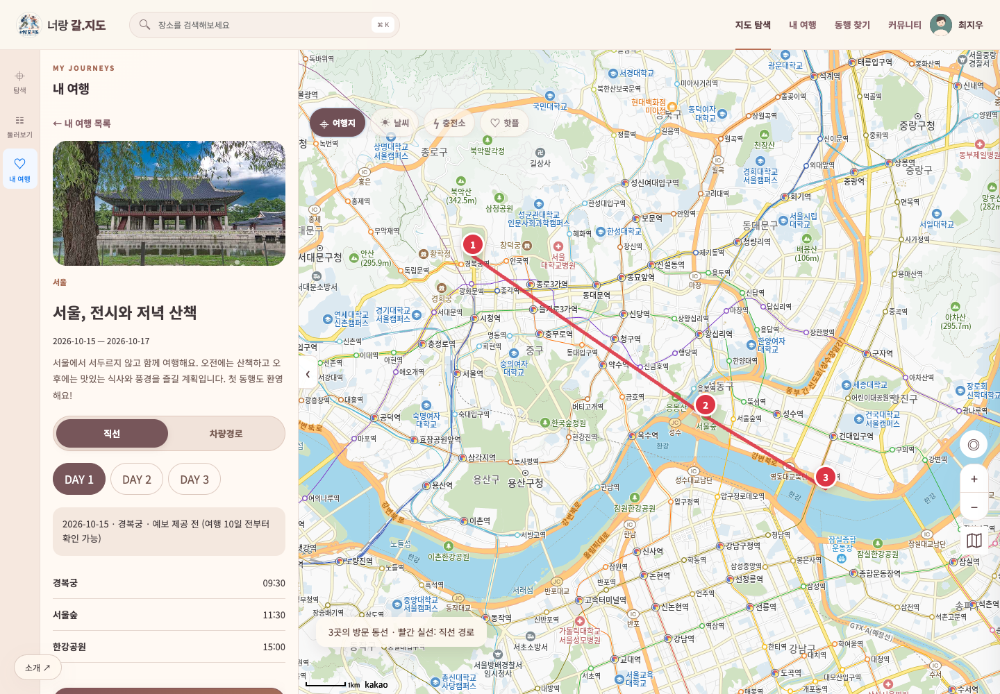

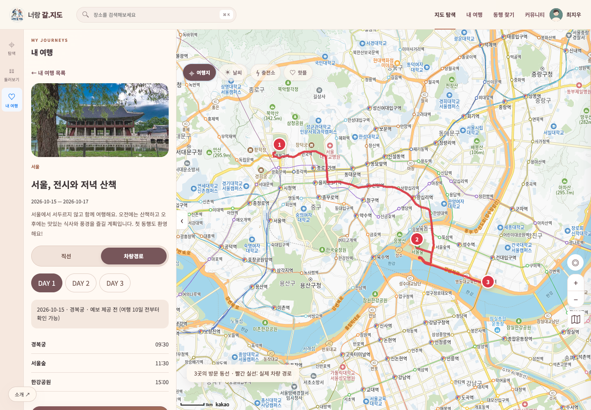

## 3. 내 여행 페이지 — 내 계획을 카드로 관리하기

### 저장 계획 목록과 세부 정보

상단 **내 여행** 메뉴에서 내가 저장한 여행을 카드로 확인합니다. 카드에는 첫 방문지 사진·여행 기간·장소 수·지역/테마·공유 여부가 표시됩니다. 카드를 누르면 해당 계획의 세부 일정과 편집 화면으로 이동합니다.

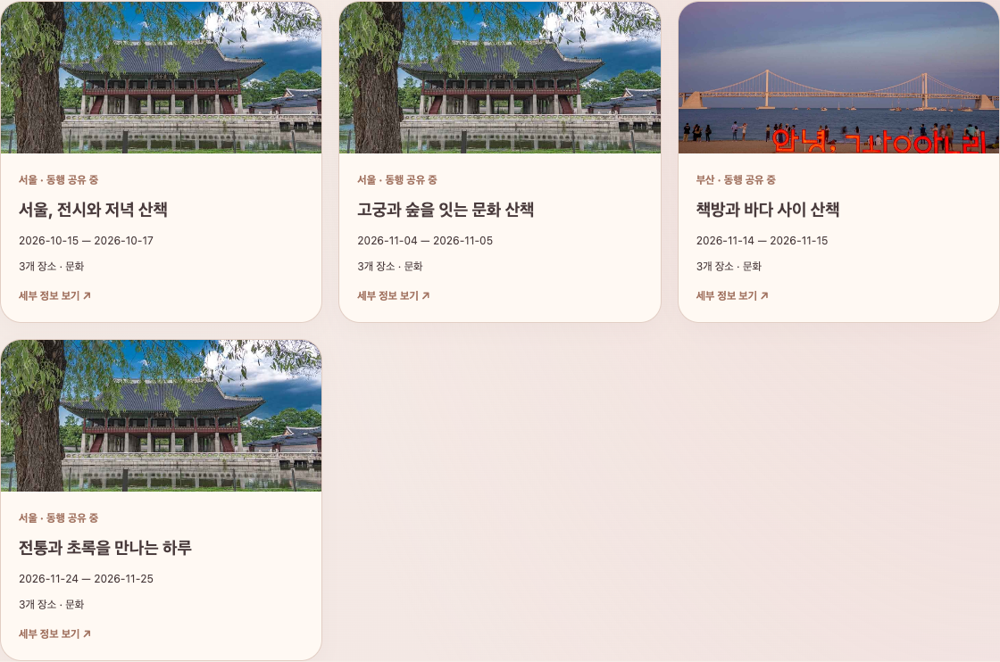

### 새 여행 작성과 날짜별 장소 추가

**＋ 새 여행**을 누르고 여행 제목, 출발일, 종료일, 동행 정원(나 포함), 예상 여행경비, 지역, 테마, 소개를 입력합니다. 지역은 서울·경기·강원·충남·충북·경남·경북·전남·전북·제주·기타 중 선택할 수 있습니다.

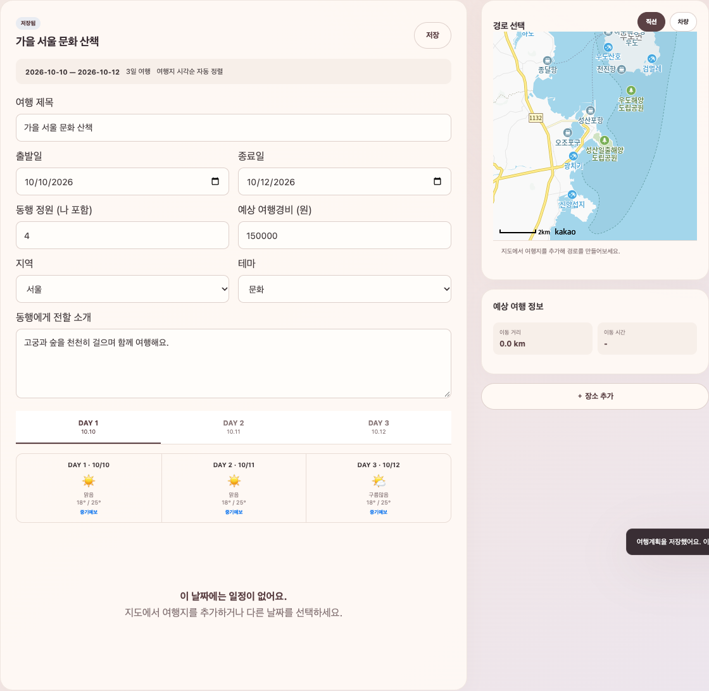

예상 여행 정보 아래 **＋ 장소 추가**를 누르면 지도 탐색으로 이동합니다. 여행지 상세에서 **일정 추가**로 담은 후 내 여행으로 돌아와 각 장소의 DAY·방문 시각·메모를 정리합니다. 일정은 방문 시각순으로 정렬되고 날짜별 날씨와 경로, 예상 이동 거리·시간을 확인할 수 있습니다.

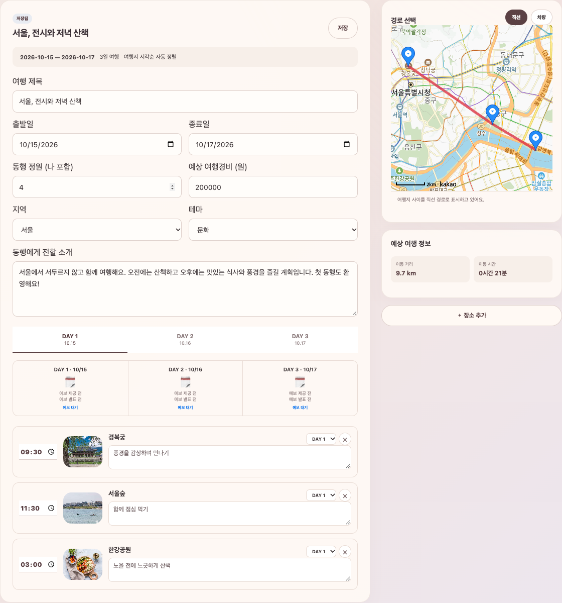

**저장 → 동행 구하기**로 계획을 공유합니다. 이미 공유한 계획은 **공유한 일정 업데이트**로 같은 모집글의 일정을 갱신하며 기존 참가자와 직접 마감한 상태를 유지합니다.

## 4. 동행 찾기 페이지 — 계획을 읽고 질문한 뒤 참가하기

### 공유된 계획 둘러보기

지역·테마·모집 상태·검색어로 여행을 찾습니다. 카드 썸네일은 각 여행의 일정상 첫 방문지 사진이며 모집 상태, 작성자, 참가자와 인원을 확인할 수 있습니다. **내가 참가한 동행만**으로 참여 중인 여행을 모아볼 수도 있습니다.

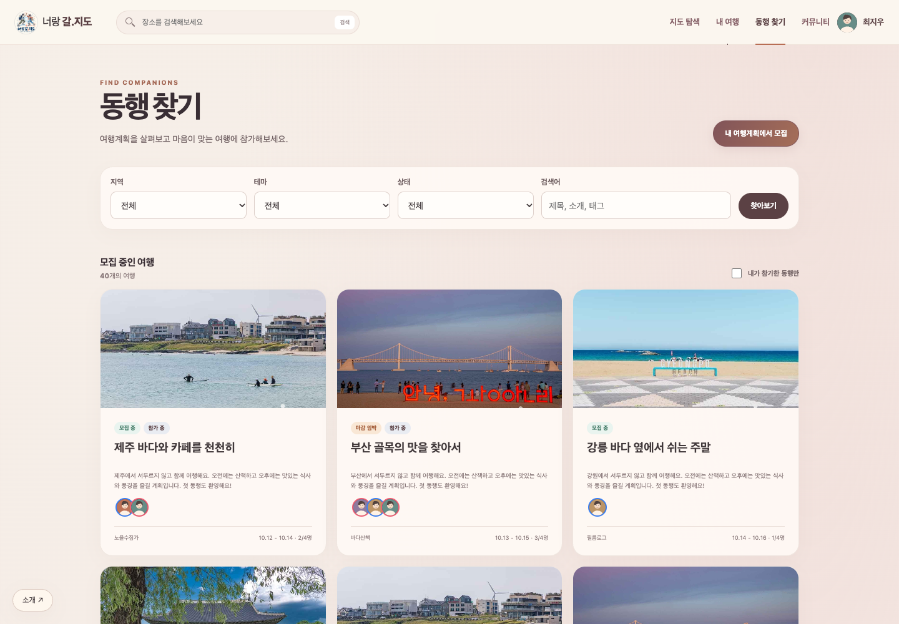

### 동행 참여와 참가 현황

카드를 열면 여행 소개, DAY별 경로·날씨, 방문 일정과 참가자 목록을 봅니다. **참가 신청**으로 참여하고 참여 후에는 **참가 취소**할 수 있습니다. 모집자는 모집글을 수정하고 **참여마감**할 수 있습니다. 정원 때문에 자동 마감된 여행은 참가 취소로 빈자리가 생기면 다시 모집하지만, 모집자가 직접 마감한 상태는 유지됩니다.

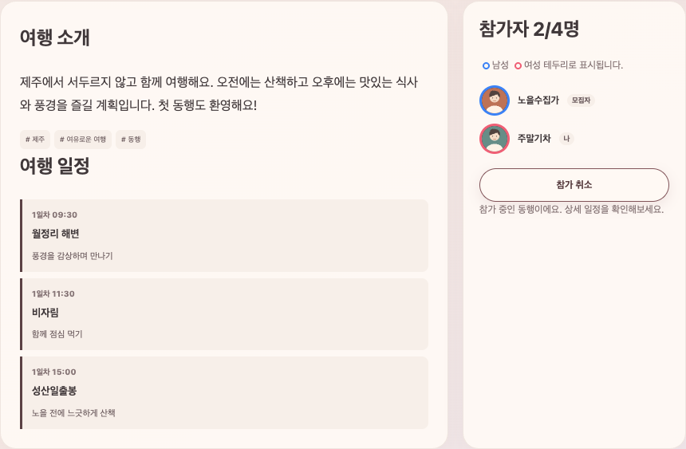

### 참가 전 질문과 답변

상세 맨 아래 **동행 질문과 답변**에서 여행에 관해 질문합니다. 로그인한 회원이면 참가 전에도 댓글·답글을 남길 수 있습니다. 종이비행기로 등록하며 작성자는 자기 댓글을 수정할 수 있습니다. 원댓글이 삭제되어도 달린 답글은 남습니다.

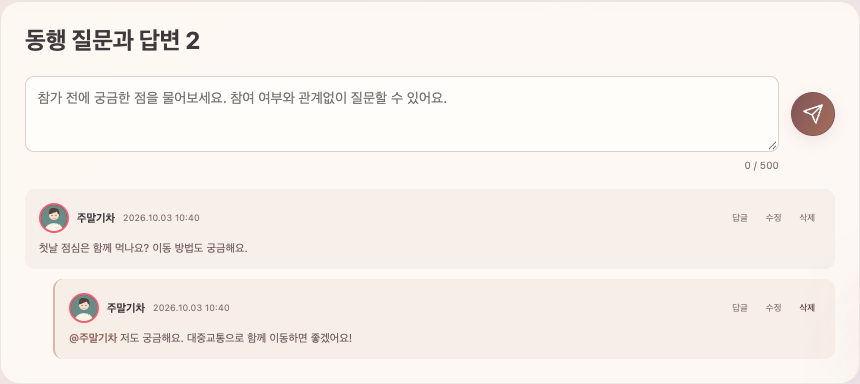

## 5. 커뮤니티 — 여행 경험을 글과 답글로 나누기

### 게시글 작성·수정·삭제

여행정보 공유·공지사항·관광 뉴스 탭에서 글을 검색하고 읽습니다. 로그인한 회원은 여행정보 공유에서 **＋ 글쓰기**로 분류·제목·내용을 작성합니다. 본인이 작성한 글의 상세에서 **수정 / 삭제**할 수 있으며 공지사항과 관광 뉴스 작성은 운영자 계정에서 가능합니다.

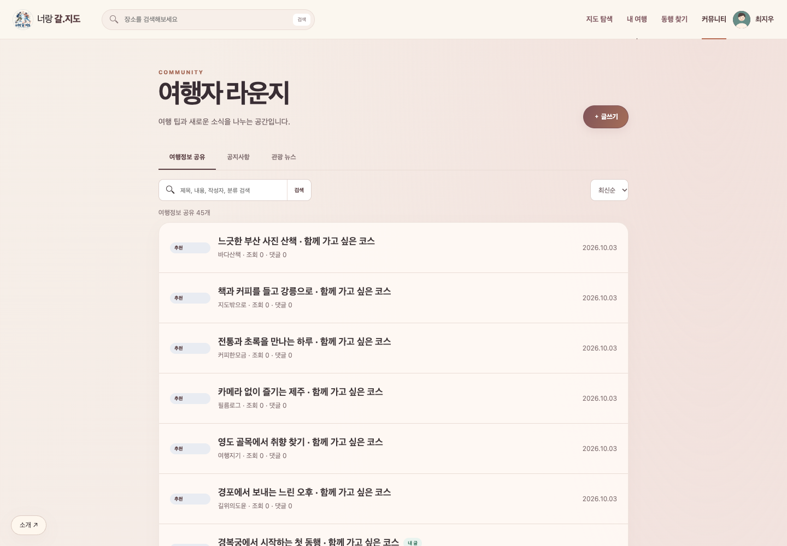

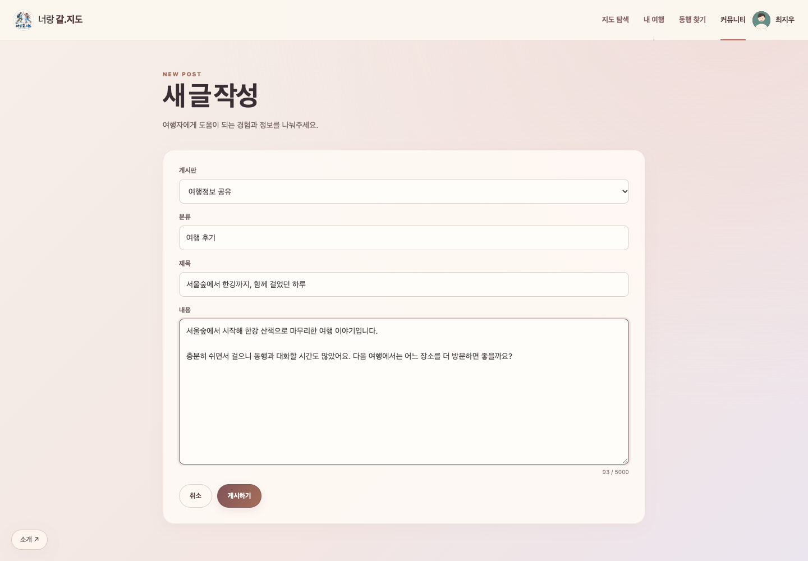

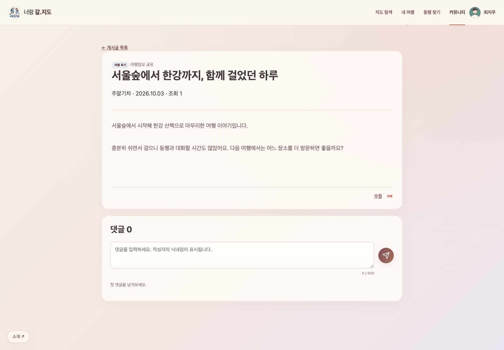

### 댓글과 대댓글

게시글 아래에서 댓글을 입력하고 종이비행기를 눌러 등록합니다. 댓글의 **답글**을 누르면 대댓글을 작성할 수 있고 답글은 해당 원댓글 아래에 표시됩니다. 수정은 댓글 작성자만, 삭제는 댓글 작성자와 게시글 작성자만 가능합니다.

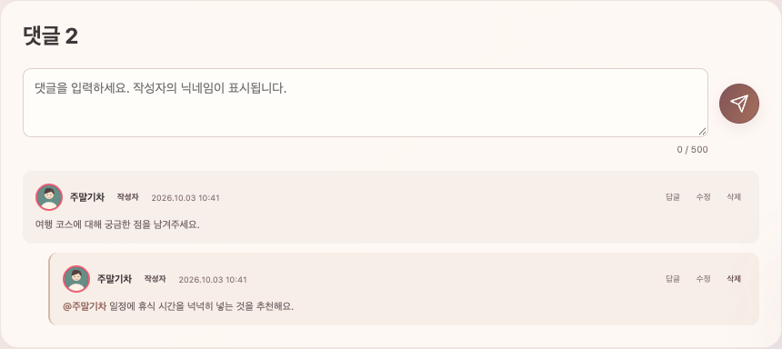

## 6. 회원가입 — 내 여행을 저장할 계정 만들기

1. 우측 프로필에서 회원 화면을 열고 **회원가입** 탭을 선택합니다.
2. 이메일, 비밀번호와 확인, 이름, 닉네임, 생년월일, 성별을 입력합니다. 프로필 사진은 선택 사항입니다.
3. 영문·숫자를 포함한 8자 이상 비밀번호를 사용합니다. 만 14세 이상 가입할 수 있으며 같은 브라우저의 중복 이메일은 사용할 수 없습니다.
4. 가입을 완료하면 로그인 상태가 되어 내 여행과 동행·게시판 기능을 이용할 수 있습니다. 로그인 때문에 이동했다면 하던 화면으로 돌아갑니다.

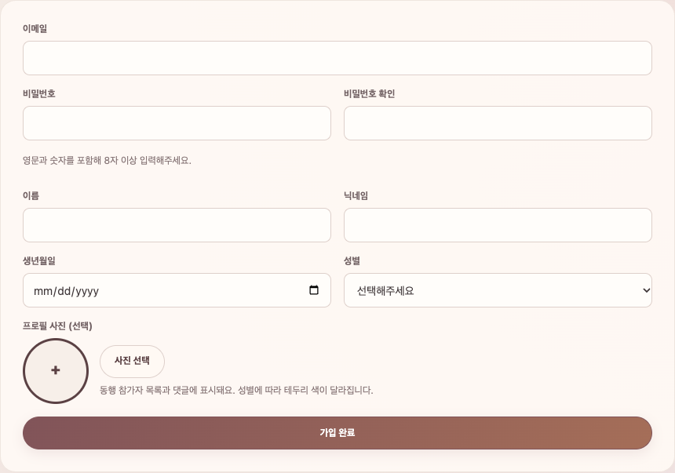

## 7. 로그인과 마이페이지 — 프로필과 내 활동 관리하기

### 로그인

회원 화면의 **로그인** 탭에서 가입한 이메일과 비밀번호를 입력합니다. 체험 계정을 선택하면 로그인 정보가 자동 입력됩니다. `traveler1@example.com`부터 `traveler10@example.com`까지 있으며 공통 비밀번호는 `Trip2026!`입니다. 10번째 계정 ‘여행지기’는 운영자입니다.

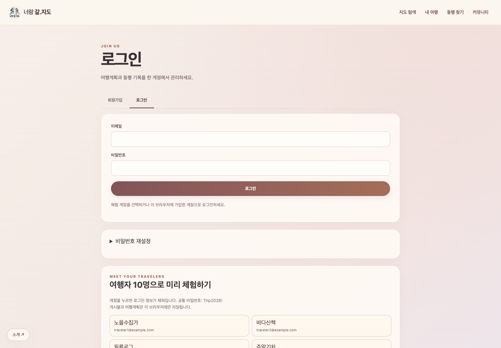

### 로그인 후 닉네임과 프로필 사진 수정

로그인 후 우측 프로필을 누르면 **마이페이지**가 열립니다. 닉네임을 바꾸거나 **사진 선택 → 프로필 저장**으로 사진을 등록할 수 있습니다. 프로필 변경은 내가 작성한 글·댓글·모집글과 참가자 목록에 반영됩니다. 설정에서 비밀번호 변경과 회원탈퇴도 가능합니다.

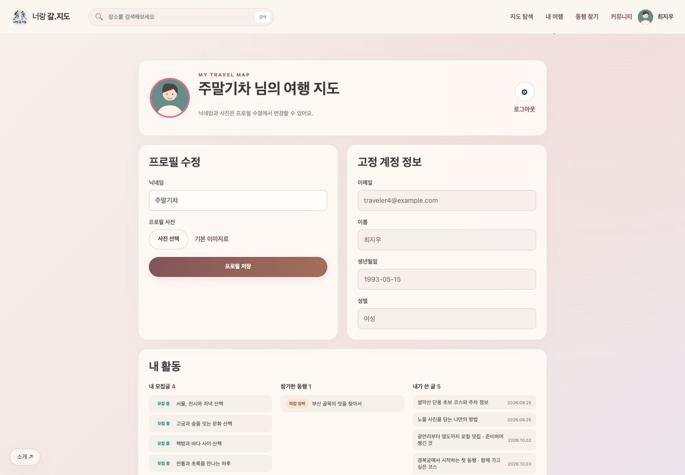

**내 활동**에서 내 모집글, 작성한 글, 참가 중인 동행을 확인하고 해당 콘텐츠로 이동합니다.

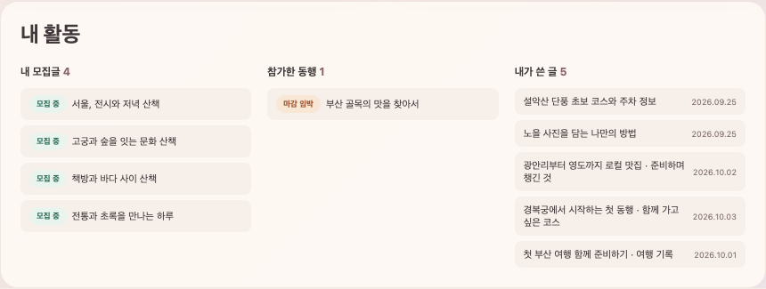

## 화면 캡처 안내

위 이미지는 2026-10-03 현재 앱을 별도 Chrome 브라우저에서 직접 조작해 캡처했습니다. 지도·날씨·충전소·로드뷰는 실제 API 화면이고, 회원·여행계획·질문·게시글은 브라우저 체험 데이터입니다. 촬영을 위한 가입·작성·참가 작업은 사용자의 기존 브라우저 데이터를 변경하지 않습니다. 외부 API 응답, 지도 위치, 로그인 계정과 데이터에 따라 표시 내용은 달라질 수 있습니다.

## 팀원 소개 및 업무 분담

| 팀원 | 담당 영역 | 주요 구현 내용 |
| --- | --- | --- |
| 김강민 | 지도·여행계획·외부 API·통합 | 카카오맵, TourAPI 주변 검색, 여행지 레이어, 기상청 예보, 충전소, 일정 편집, 카카오모빌리티 경로, 공통 상태 구조, 통합 테스트 |
| 마예은 | 회원·동행·커뮤니티 | 회원가입·로그인, 프로필 관리, 동행 목록·상세·참가 권한, 게시글·댓글 CRUD와 소유자 권한, 서브페이지 반응형·접근성 |

공통 파일은 변경 전 구조를 합의하고, 페이지 단위로 담당 파일을 나눠 충돌을 줄였습니다. 자세한 기준은 [업무 분담 문서](./docs/WORK_SPLIT.md)를 참고하세요.

## 기술 구성

| 구분 | 사용 기술 |
| --- | --- |
| 마크업·스타일 | HTML5, CSS3, 반응형 미디어 쿼리 |
| 프론트엔드 | Vanilla JavaScript, ES Modules, Fetch API |
| 지도·경로 | Kakao Maps JavaScript API, Kakao Mobility Directions API |
| 관광 데이터 | 한국관광공사 국문관광정보 서비스 TourAPI |
| 날씨 | 기상청 단기예보·중기예보 API |
| 기타 데이터 | 한국환경공단 전기차 충전소 API, Sunrise-Sunset API |
| 상태 저장 | Web Storage API (`localStorage`) |
| 개발 서버 | Node.js 기본 `http` 모듈 |

## 실행 방법

### 1. 저장소 실행

별도 패키지 설치는 필요하지 않습니다. ES Module과 카카오모빌리티 프록시를 사용하므로 HTML 파일을 직접 열지 말고 로컬 서버로 실행합니다.

```bash
node dev-server.js
```

브라우저에서 [http://localhost:5500](http://localhost:5500)을 엽니다.

VS Code Live Server로 일반 화면을 확인할 수는 있지만, 차량 경로 프록시까지 테스트하려면 `dev-server.js` 사용을 권장합니다.

### 2. API 설정

`config.example.js`를 복사해 `config.js`를 만들고 발급받은 키를 입력합니다.

```bash
cp config.example.js config.js
```

Windows PowerShell:

```powershell
Copy-Item config.example.js config.js
```

```js
window.APP_CONFIG = {
  KAKAO_JS_KEY: "",
  KAKAO_REST_KEY: "",
  TOUR_API_KEY: "",
  WEATHER_API_KEY: "",
  EV_CHARGER_API_KEY: "",
  SGIS_CONSUMER_KEY: "",
  SGIS_CONSUMER_SECRET: "",
  API_PROXY_URL: "http://localhost:5500",
};
```

`config.js`는 `.gitignore`에 포함되어 있으므로 Git에 커밋되지 않습니다.

### 3. API 사용 시 확인사항

- 카카오 JavaScript 키: 앱의 Web 플랫폼에 `http://localhost:5500` 등록
- 카카오 REST API 키: 차량 길찾기 요청에 사용
- 공공데이터포털 키: `URLSearchParams`가 인코딩하므로 일반적으로 Decoding 키 사용
- 기상청 중기예보: 별도 활용 신청 및 승인 상태 확인
- `API_PROXY_URL`: 기본 개발 서버를 사용할 때 `http://localhost:5500` 지정

## 데이터 출처

- [한국관광공사 국문관광정보 서비스](https://www.data.go.kr/data/15101578/openapi.do)
- [SGIS 오픈 API](https://sgis.kostat.go.kr/developer/html/main.html)
- [카카오 지도 Web API](https://apis.map.kakao.com/web/)
- [카카오모빌리티 길찾기 API](https://developers.kakaomobility.com/docs/navi-api/directions/)
- [기상청 단기예보 조회서비스](https://www.data.go.kr/data/15084084/openapi.do)
- [기상청 중기예보 조회서비스](https://www.data.go.kr/data/15059468/openapi.do)
- 한국환경공단 전기자동차 충전소 정보
- [Sunrise-Sunset API](https://sunrise-sunset.org/api)

## 프로젝트 구조

```text
.
├─ index.html                  # 지도 탐색
├─ planner.html                # 내 여행 계획·편집
├─ signup.html                 # 회원가입·로그인
├─ mypage.html                 # 프로필·계정 관리
├─ companions.html            # 동행 목록
├─ companion-detail.html      # 동행 상세
├─ community.html             # 커뮤니티 목록
├─ post-detail.html           # 게시글·댓글
├─ post-write.html            # 게시글 작성·수정
├─ dev-server.js              # 정적 서버·카카오모빌리티 프록시
├─ config.example.js          # API 설정 예시
├─ assets/                    # 로고·이미지
├─ css/
│  ├─ style.css               # 지도·공통 UI
│  └─ subpages.css            # 서브페이지 UI
├─ docs/
│  ├─ WORK_SPLIT.md           # 업무 분담
│  └─ TROUBLE_SHOOTING.md     # 문제 해결 기록
└─ js/
   ├─ api.js                  # 외부 API 모듈
   ├─ app.js                  # 지도 탐색
   ├─ planner.js              # 여행계획
   ├─ shared.js               # 공통 상태·UI 유틸리티
   ├─ account.js              # 계정·프로필 유틸리티
   ├─ companion-utils.js      # 동행 상태·권한 유틸리티
   ├─ board.js                # 게시판 상태·권한 유틸리티
   └─ 페이지별 스크립트
```

## 상태 저장 방식

프론트엔드 프로젝트 범위에 맞춰 다음 데이터를 `neorang-galjido-v1` 키의 `localStorage`에 저장합니다.

- 회원·프로필 정보와 로그인 상태
- 찜한 장소와 여행 일정
- 동행 모집글과 참가 상태
- 게시글과 댓글
- 여행계획 기반 인기 장소 집계와 지도 설정

브라우저 저장소를 삭제하면 데모 초기 상태로 돌아갑니다. 실제 서비스로 확장할 때는 비밀번호를 브라우저에 저장하지 않고 서버 인증, 데이터베이스, 이미지 스토리지를 사용해야 합니다.

## 검증 방법

```bash
node --check js/app.js
node --check js/planner.js
node --check js/shared.js
git diff --check
```

통합 시에는 지도 이동·레이어 토글·일정 저장·차량 경로·회원가입·동행 참가·게시글과 댓글 권한을 브라우저에서 함께 확인합니다.

## 트러블슈팅

지도 위치와 무관하게 제주 관광지만 표시되던 문제, 차량 경로 CORS, 날씨 예보 기간 결합, 프로필 이미지 저장 용량, Git 충돌 방지 과정은 [트러블슈팅 문서](./docs/TROUBLE_SHOOTING.md)에 정리했습니다.

## 체험 데이터와 검증

추가 체험 데이터는 기존 브라우저에 한 번만 더해지고 기존 수정 내용은 유지합니다. 내 여행 목록에는 로그인한 계정이 작성한 계획만 표시됩니다.

개발 서버를 실행한 뒤 Playwright와 설치된 Chrome으로 검증합니다. Playwright가 기본 모듈 경로에 없으면 `PLAYWRIGHT_MODULE`에 패키지의 절대 경로를 지정하세요.

```bash
node tests/e2e.cjs
node tests/live.cjs
node tests/workspace-join.cjs
node tests/comments.cjs
node tests/plan-cards.cjs
node tests/companion-thumbnails.cjs
node tests/demo-expansion.cjs
```

통합 기능 검증은 62개 체크를 통과했습니다. 실 API 검증에는 `config.js` 설정이 필요합니다. 전체 요구사항과 검증 범위는 [기능 검증 보고서](./docs/FEATURE_AUDIT.md), 문제의 원인과 해결 과정은 [트러블슈팅](./docs/TROUBLE_SHOOTING.md)에 정리했습니다.
