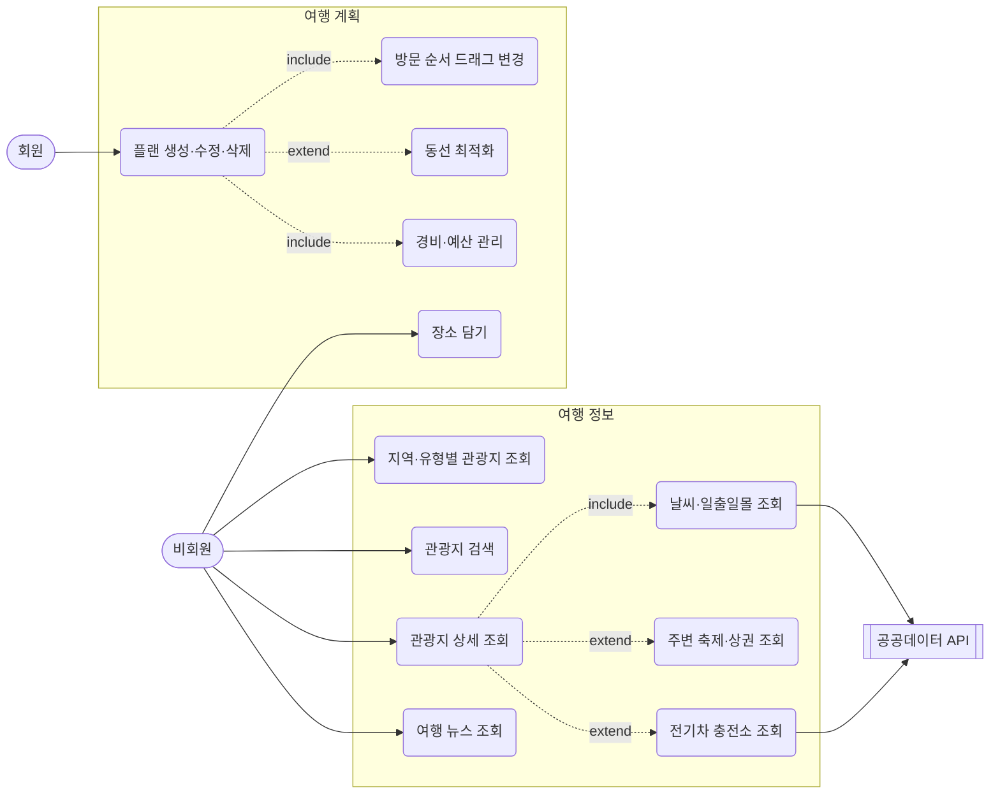
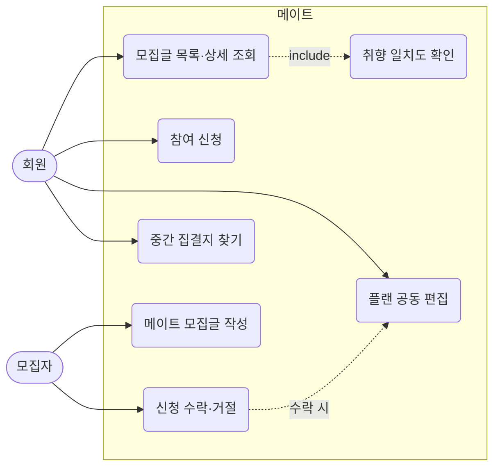
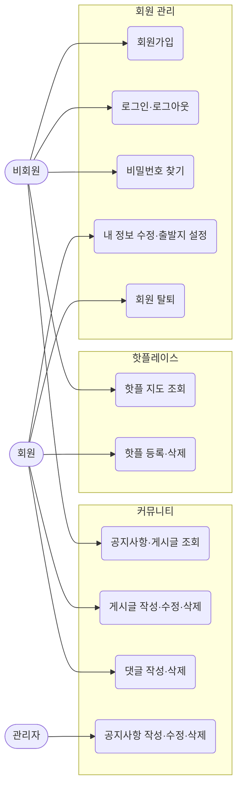
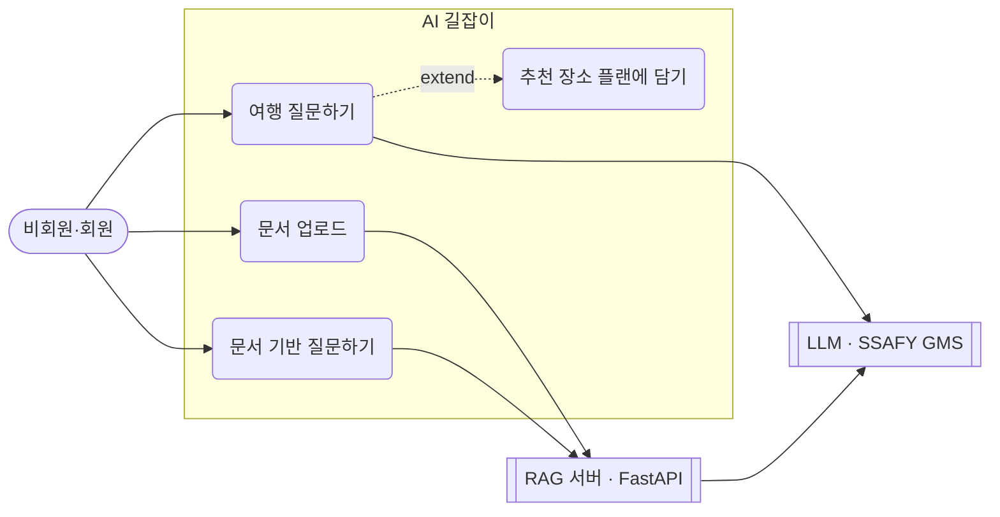

# Usecase Diagram

액터는 **비회원**, **회원**, **모집자**(플랜을 만든 회원), **관리자**, 그리고 외부 시스템(공공데이터 API, LLM, RAG 서버)이다.

## 1. 여행 정보·계획

```mermaid
flowchart LR
    guest([비회원])
    member([회원])
    subgraph 여행 정보
        U1(지역·유형별 관광지 조회)
        U2(관광지 검색)
        U3(관광지 상세 조회)
        U4(날씨·일출일몰 조회)
        U5(주변 축제·상권 조회)
        U6(전기차 충전소 조회)
        U7(여행 뉴스 조회)
    end
    subgraph 여행 계획
        P1(장소 담기)
        P2(플랜 생성·수정·삭제)
        P3(방문 순서 드래그 변경)
        P4(동선 최적화)
        P5(경비·예산 관리)
    end
    api[[공공데이터 API]]
    guest --> U1 & U2 & U3 & U7
    guest --> P1
    member --> P2
    U3 -.include.-> U4
    U3 -.extend.-> U5
    U3 -.extend.-> U6
    P2 -.include.-> P3
    P2 -.extend.-> P4
    P2 -.include.-> P5
    U4 --> api
    U6 --> api
```

## 2. 메이트

```mermaid
flowchart LR
    member([회원])
    owner([모집자])
    subgraph 메이트
        M1(모집글 목록·상세 조회)
        M2(취향 일치도 확인)
        M3(메이트 모집글 작성)
        M4(참여 신청)
        M5(신청 수락·거절)
        M6(플랜 공동 편집)
        M7(중간 집결지 찾기)
    end
    member --> M1 & M4 & M6 & M7
    owner --> M3 & M5
    M1 -.include.-> M2
    M5 -.수락 시.-> M6
```

## 3. 회원·커뮤니티·핫플레이스

```mermaid
flowchart LR
    guest([비회원])
    member([회원])
    admin([관리자])
    subgraph 회원 관리
        A1(회원가입)
        A2(로그인·로그아웃)
        A3(비밀번호 찾기)
        A4(내 정보 수정·출발지 설정)
        A5(회원 탈퇴)
    end
    subgraph 커뮤니티
        B1(공지사항·게시글 조회)
        B2(게시글 작성·수정·삭제)
        B3(댓글 작성·삭제)
        B4(공지사항 작성·수정·삭제)
    end
    subgraph 핫플레이스
        H1(핫플 지도 조회)
        H2(핫플 등록·삭제)
    end
    guest --> A1 & A2 & A3 & B1 & H1
    member --> A4 & A5 & B2 & B3 & H2
    admin --> B4
```

## 4. AI 길잡이

```mermaid
flowchart LR
    user([비회원·회원])
    subgraph AI 길잡이
        C1(여행 질문하기)
        C2(추천 장소 플랜에 담기)
        C3(문서 업로드)
        C4(문서 기반 질문하기)
    end
    llm[[LLM · SSAFY GMS]]
    rag[[RAG 서버 · FastAPI]]
    user --> C1 & C3 & C4
    C1 -.extend.-> C2
    C1 --> llm
    C3 --> rag
    C4 --> rag
    rag --> llm
```
